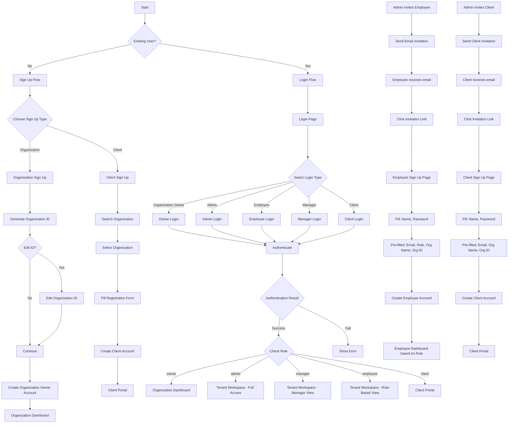

# Future Login & Signup Plan

## Overview
This document outlines the proposed new login and signup system for the SISWIT SaaS platform. The current system allows users to sign up individually with automatic role assignment, but this new plan introduces a structured organization-based signup flow with proper role management through invitations.

---

## Current System Issues

1. Users can sign up as "Employee" and get admin role by default
2. No organization-level structure
3. No invitation system for adding employees
4. No proper role-based access control
5. Client portal access is too simplified

---

## New Authentication Flow



---

## Sign Up Flow - Detailed

### 1. Organization Sign Up

**New Sign Up Page URL:** `/auth/sign-up` or `/auth/organization-signup`

**Form Fields:**
- Organization Name (required)
- Organization ID (auto-generated, editable)
- Owner Full Name (required)
- Owner Email (required)
- Owner Password (required)
- Confirm Password (required)

**Organization ID Generation:**
```
Format: [First 3-5 letters of org name] + [Random 4-digit number]
Example: "Acme Corporation" → ACME1234

User can edit the ID after generation with:
- Minimum 3 characters
- Maximum 20 characters
- Only letters and numbers allowed
- Must be unique across platform
```

**Popup Warning:**
```
⚠️ Important: Save Your Organization ID

Your Organization ID is: ACME1234

This ID is unique to your organization and will be used 
to identify your workspace. 

Please save this ID safely - you will need it to:
- Invite employees
- Access your organization

[Copy to Clipboard] [I've Saved It] [Edit ID]
```

**After Submission:**
1. Create organization record in `organizations` table
2. Create owner user in `auth.users`
3. Create owner profile in `profiles` table
4. Create owner record in `organization_owners` table
5. Create subscription record (free trial/default plan)
6. Redirect to Organization Dashboard

---

### 2. Employee Invitation Flow

**Admin sends invitation from:** Organization Dashboard → Team Management → Invite Employee

**Invitation Form (Admin fills):**
- Employee Email (required)
- Role Selection (required):
  - Admin
  - Manager
  - Employee → Opens sub-options:
    - Sales
    - HR
    - Marketing
    - Finance
    - Operations
    - Custom (opens textarea for custom role)
- Custom Role Name (if "Custom" selected)
- Invitation Expiry (default: 2 days, editable by admin)
- Personal Message (optional)

**Email Sent to Employee:**
```
Subject: You're invited to join [Organization Name] on SISWIT

Hi [Employee Name],

You've been invited to join [Organization Name] as a [Role] on SISWIT.

Organization: [Organization Name]
Organization ID: [Organization ID]
Role: [Role]

Click the link below to create your account:
[Accept Invitation Link - expires on {date}]

Best regards,
[Admin Name]
[Organization Name]
```

**Employee Sign Up Page (via Invitation Link):** `/auth/accept-invitation?token=xxx`

**Pre-filled Fields (Read-Only/Greyed Out):**
- Email: employee@company.com (from invitation)
- Role: Sales (from admin selection)
- Organization Name: Acme Corp
- Organization ID: ACME1234

**Editable Fields:**
- Full Name (required)
- Employee ID (optional)
- Password (required)
- Confirm Password (required)

**After Submission:**
1. Validate invitation token
2. Check expiry
3. Create user account
4. Create profile
5. Assign role based on invitation
6. Mark invitation as accepted
7. Redirect to Role-Based Dashboard

---

## Login Flow - Detailed

### New Login Page UI

**URL:** `/auth/sign-in`

**New Layout:** Three distinct sections for Owner, Employee, and Client

```
┌─────────────────────────────────────────────────────────┐
│                    SISWIT Logo                          │
├─────────────────────────────────────────────────────────┤
│                                                         │
│   ┌─────────────────────────────────────────────────┐   │
│   │         Login as Organization Owner             │   │
│   │    [Sign in to manage your organization]        │   │
│   │              [Owner Login]                      │   │
│   └─────────────────────────────────────────────────┘   │
│                                                         │
│   ┌─────────────────────────────────────────────────┐   │
│   │         Login as Employee                       │   │
│   │    [Admin, Manager, or Team Member]             │   │
│   │              [Employee Login]                   │   │
│   └─────────────────────────────────────────────────┘   │
│                                                         │
│   ┌─────────────────────────────────────────────────┐   │
│   │         Login as Client                         │   │
│   │    [External clients & partners]                │   │
│   │              [Client Login]                     │   │
│   └─────────────────────────────────────────────────┘   │
│                                                         │
│   ───────────────────────────────────────────────────   │
│                                                         │
│   Don't have an account?                                │
│   [Sign Up Your Organization]  [Sign Up as Client]      │
│                                                         │
└─────────────────────────────────────────────────────────┘
```

### Login Form Options

#### Option 1: Owner Login
- **Fields:** Email, Password
- **After Login:** Organization Dashboard with owner features

#### Option 2: Employee Login (Modal/Tabs)
```
┌────────────────────────────────────────┐
│  [Admin] [Manager] [Employee]          │
├────────────────────────────────────────┤
│  Email: _________________________      │
│  Password: ________________________    │
│                                        │
│  [ ] Remember me                       │
│  [Forgot Password?]                    │
│                                        │
│  [Sign In]                             │
└────────────────────────────────────────┘
```

---

## Role-Based Access Control

### 1. Organization Owner

**Dashboard:** `/organization/*` (separate from tenant workspace)

**Features:**
- Organization Settings
- Subscription Management
  - View current plan
  - See expiry date
  - Manage add-ons
  - Upgrade/Downgrade plan
- Invite Admins
- View all team members
- Billing & Invoices
- Analytics Overview

**Permissions:** Full control over organization

---

### 2. Admin Role

**Dashboard:** `/:tenantSlug/app/dashboard`

**Features:**
- Full module access (based on subscription plan)
- CRM, CPQ, CLM, ERP, Documents
- User Management (invite employees)
- Role Assignment
- Organization Settings (limited)
- Subscription View (no modification)

**Permissions:**
- Can invite employees
- Can assign roles
- Full access to all enabled modules

---

### 3. Manager Role

**Dashboard:** `/:tenantSlug/app/dashboard`

**Sidebar Menu:** Limited to manager-specific modules
- Dashboard
- Only assigned department (Sales/HR/Marketing/etc.)
- Documents (limited)

**Permissions:**
- Cannot invite employees
- Cannot access settings
- Only sees assigned team/department data

---

### 4. Employee Role

**Dashboard:** `/:tenantSlug/app/dashboard`

**Role Sub-types:**
- Sales
- HR
- Marketing
- Finance
- Operations
- Custom (defined by admin)

**Sidebar Menu:** Based on role sub-type
- Only sees relevant modules
- Limited to own data records

**Example - Sales Role:**
- Dashboard
- CRM (Leads, Opportunities - own only)
- CPQ (Quotes - own only)
- Documents (own only)

---

## Database Schema Changes

### New Tables

```sql
-- organizations table
CREATE TABLE organizations (
  id UUID PRIMARY KEY DEFAULT uuid_generate_v4(),
  name VARCHAR(255) NOT NULL,
  slug VARCHAR(50) UNIQUE NOT NULL, -- Organization ID
  owner_id UUID REFERENCES auth.users(id),
  subscription_id UUID REFERENCES subscriptions(id),
  created_at TIMESTAMPTZ DEFAULT NOW(),
  updated_at TIMESTAMPTZ DEFAULT NOW()
);

-- organization_owners table
CREATE TABLE organization_owners (
  id UUID PRIMARY KEY DEFAULT uuid_generate_v4(),
  organization_id UUID REFERENCES organizations(id),
  user_id UUID REFERENCES auth.users(id),
  created_at TIMESTAMPTZ DEFAULT NOW()
);

-- invitations table
CREATE TABLE invitations (
  id UUID PRIMARY KEY DEFAULT uuid_generate_v4(),
  organization_id UUID REFERENCES organizations(id),
  email VARCHAR(255) NOT NULL,
  role VARCHAR(50) NOT NULL,
  custom_role_name VARCHAR(100),
  invited_by UUID REFERENCES auth.users(id),
  token VARCHAR(255) UNIQUE NOT NULL,
  expires_at TIMESTAMPTZ NOT NULL,
  accepted_at TIMESTAMPTZ,
  status VARCHAR(20) DEFAULT 'pending',
  created_at TIMESTAMPTZ DEFAULT NOW()
);

-- employee_roles table (for sub-roles)
CREATE TABLE employee_roles (
  id UUID PRIMARY KEY DEFAULT uuid_generate_v4(),
  organization_id UUID REFERENCES organizations(id),
  name VARCHAR(100) NOT NULL,
  is_custom BOOLEAN DEFAULT FALSE,
  permissions JSONB,
  created_at TIMESTAMPTZ DEFAULT NOW()
);
```

### Modified Tables

```sql
-- tenant_users - add new fields
ALTER TABLE tenant_users ADD COLUMN organization_id UUID REFERENCES organizations(id);
ALTER TABLE tenant_users ADD COLUMN employee_role_id UUID REFERENCES employee_roles(id);
ALTER TABLE tenant_users ADD COLUMN is_owner BOOLEAN DEFAULT FALSE;

-- Remove: role 'client' handling (will be separate)
```

---

## Invitation Flow States

```
┌─────────────┐     ┌─────────────┐     ┌─────────────┐     ┌─────────────┐
│  PENDING   │────▶│    SENT     │────▶│  ACCEPTED  │────▶│   EXPIRED   │
└─────────────┘     └─────────────┘     └─────────────┘     └─────────────┘
      │                   │                   │                   │
      │                   │                   │                   │
   Created by        Email sent to       Account created    Token expired
   admin             employee             and active        (if not accepted)
```

---

## UI/UX Changes Summary

### Current → Future Comparison

| Feature | Current | Future |
|---------|---------|--------|
| Sign Up | Individual + Role Selection | Organization First + Client |
| Organization ID | Not exists | Auto-generated + Editable |
| Role Assignment | User selects | Admin assigns via invitation |
| Employee Adding | Self-signup | Admin invitation only |
| Client Access | Self-signup only | Invitation OR Self-Signup |
| Login Page | Simple email/password | Owner vs Employee vs Client sections |
| Default Role | Admin (for employees) | Based on invitation |
| Custom Roles | Not supported | Supported via "Other" option |
| Invitation Expiry | Not exists | 2 days default, admin editable |
| Support Tickets | Not exists | Full ticketing system |
| Forgot Password | Not implemented | Email-based reset |
| Remember Me | Basic checkbox | Persistent login option |

---

## Implementation Phases

### Phase 1: Organization Sign Up
- Create organization sign up form
- Generate editable organization ID
- Create owner dashboard
- Update auth flow

### Phase 2: Invitation System
- Create invitation management
- Email invitation with token
- Accept invitation page
- Role assignment during invitation

### Phase 3: Role-Based Access
- Implement RBAC for modules
- Manager role restrictions
- Employee role restrictions
- Custom role support

### Phase 4: Login UI Redesign
- New login page layout
- Owner vs Employee vs Client sections
- Remember me improvements
- Forgot password flow

### Phase 5: Client Portal
- Support tickets system
- Organization search for self-signup
- Client invitation flow

### Phase 6: Password Recovery
- Forgot password page
- Email-based reset token
- Reset password flow

---

## Summary

### Organization Side:
1. **Organization First** - Users sign up their organization, not individual accounts
2. **Owner Role** - Organization owner can manage subscription and invite admins
3. **Invitation-Based** - Employees can only join via admin invitation
4. **Role Assignment** - Admin assigns role during invitation (not self-selected)
5. **Custom Roles** - Support for custom role names beyond predefined options
6. **Complete Isolation** - Complete data isolation per organization
7. **Expiry Control** - Invitations expire and can be controlled by admin

---

# Client Side Plan

## Overview
This section covers the client portal flow for external clients of organizations.

---

## Client Access Methods

### Method 1: Invitation by Organization
- Organization admin/employee invites client via email
- Client receives invitation link
- Client clicks link → fills password → accesses portal

### Method 2: Self-Signup
- Client visits sign up page
- Searches for their organization by:
  - Organization Name
  - Organization ID
- Selects their organization
- Creates account → gets instant access

---

## Client Sign Up Flow (Self-Signup)

### Step 1: Select Sign Up Type
```
┌─────────────────────────────────────────────────────────┐
│                    SISWIT Logo                          │
├─────────────────────────────────────────────────────────┤
│                                                         │
│   ┌─────────────────────────────────────────────────┐   │
│   │         Sign Up Your Organization               │   │
│   │    [For internal team members]                  │   │
│   │              [Organization Sign Up]             │   │
│   └─────────────────────────────────────────────────┘   │
│                                                         │
│   ┌─────────────────────────────────────────────────┐   │
│   │         Sign Up as Client                       │   │
│   │     [For external clients]                      │   │
│   │              [Client Sign Up]                   │   │
│   └─────────────────────────────────────────────────┘   │
│                                                         │
└─────────────────────────────────────────────────────────┘
```

### Step 2: Find Organization
- Search by Organization Name OR Organization ID
- Auto-complete dropdown with matching organizations
- Select from results

### Step 3: Client Registration
**Pre-filled (from organization selection):**
- Organization Name (read-only)
- Organization ID (read-only)

**Editable Fields:**
- Full Name (required)
- Email (required)
- Password (required)
- Confirm Password (required)
- Phone Number (optional)

---

## Client Invitation Flow

### Admin sends invitation from:
Organization Dashboard → Clients → Invite Client

### Invitation Form:
- Client Email (required)
- Personal Message (optional)
- Invitation Expiry (default: 7 days)

### Email to Client:
```
Subject: You've been invited to access [Organization Name] Portal

Hi,

You've been invited to the client portal for [Organization Name].

Organization: [Organization Name]
Organization ID: [Organization ID]

Click the link below to create your account:
[Accept Invitation Link]

Best regards,
[Organization Name]
```

### Client Sign Up (via Invitation Link)
**URL:** `/auth/accept-client-invitation?token=xxx`

**Pre-filled (read-only):**
- Email
- Organization Name
- Organization ID

**Editable:**
- Full Name
- Password
- Confirm Password

---

## Client Portal Features

### Current Features (Kept):
- **Dashboard** - Overview of quotes, contracts, documents
- **My Quotes** - View all quotes from organization
- **My Contracts** - View and sign contracts
- **Documents** - Access shared documents
- **E-Signatures** - Sign pending documents

### New Feature: Support Tickets

#### Create Ticket
- Subject (required)
- Category:
  - Technical Issue
  - Billing
  - Account
  - General Inquiry
- Description (required)
- Priority:
  - Low
  - Medium
  - High
  - Urgent
- Attachments (optional, max 5 files)

#### Ticket Statuses
- **Open** - Newly created
- **In Progress** - Being worked on
- **Resolved** - Solution provided
- **Closed** - Confirmed resolved

#### Ticket View
- View all past tickets
- View ticket status
- Add replies to ticket
- View attached files

---

## Login Page - Updated Design

### Final Login Page Layout
```
┌─────────────────────────────────────────────────────────┐
│                    SISWIT Logo                          │
├─────────────────────────────────────────────────────────┤
│                                                         │
│   ┌─────────────────────────────────────────────────┐   │
│   │         Login as Organization Owner             │   │
│   │    [Manage organization & team]                 │   │
│   │              [Owner Login]                      │   │
│   └─────────────────────────────────────────────────┘   │
│                                                         │
│   ┌─────────────────────────────────────────────────┐   │
│   │         Login as Employee                       │   │
│   │    [Admin, Manager, Team Member]                │   │
│   │              [Employee Login]                   │   │
│   └─────────────────────────────────────────────────┘   │
│                                                         │
│   ┌─────────────────────────────────────────────────┐   │
│   │         Login as Client                         │   │
│   │    [View quotes, contracts, get support]        │   │
│   │              [Client Login]                     │   │
│   └─────────────────────────────────────────────────┘   │
│                                                         │
│   ─────────────────────────────────────────────         │
│                                                         │
│   Don't have an account?                                │
│   [Sign Up Organization]  [Sign Up as Client]           │
│                                                         │
└─────────────────────────────────────────────────────────┘
```

### Login Options Detail

#### Owner Login
- Email + Password
- Remember Me checkbox
- Forgot Password link

#### Employee Login
- Tabbed: [Admin] [Manager] [Employee]
- Email + Password
- Remember Me checkbox
- Forgot Password link

#### Client Login
- Email + Password
- Organization ID (optional - for verification)
- Remember Me checkbox
- Forgot Password link

---

## Password Recovery Flow

### Forgot Password Page
```
┌─────────────────────────────────────────────────────────┐
│                    SISWIT Logo                          │
├─────────────────────────────────────────────────────────┤
│                                                         │
│   ┌─────────────────────────────────────────────────┐   │
│   │         Forgot Password?                        │   │
│   │                                                 │   │
│   │   Enter your email and we'll send you           │   │
│   │   a link to reset your password.                │   │
│   │                                                 │   │
│   │   Email: _________________________              │   │
│   │                                                 │   │
│   │   [Send Reset Link]  [Back to Login]            │   │
│   └─────────────────────────────────────────────────┘   │
│                                                         │
└─────────────────────────────────────────────────────────┘
```

### Reset Password Email
- Contains unique reset token link
- Link expires in 1 hour
- User clicks → enters new password

---

## Database Updates for Clients

### New Tables

```sql
-- client_invitations table
CREATE TABLE client_invitations (
  id UUID PRIMARY KEY DEFAULT uuid_generate_v4(),
  organization_id UUID REFERENCES organizations(id),
  email VARCHAR(255) NOT NULL,
  invited_by UUID REFERENCES auth.users(id),
  token VARCHAR(255) UNIQUE NOT NULL,
  expires_at TIMESTAMPTZ NOT NULL,
  accepted_at TIMESTAMPTZ,
  status VARCHAR(20) DEFAULT 'pending',
  created_at TIMESTAMPTZ DEFAULT NOW()
);

-- support_tickets table
CREATE TABLE support_tickets (
  id UUID PRIMARY KEY DEFAULT uuid_generate_v4(),
  organization_id UUID REFERENCES organizations(id),
  client_id UUID REFERENCES tenant_users(id),
  subject VARCHAR(255) NOT NULL,
  category VARCHAR(50) NOT NULL,
  description TEXT NOT NULL,
  priority VARCHAR(20) DEFAULT 'medium',
  status VARCHAR(20) DEFAULT 'open',
  created_at TIMESTAMPTZ DEFAULT NOW(),
  updated_at TIMESTAMPTZ DEFAULT NOW()
);

-- support_ticket_attachments
CREATE TABLE support_ticket_attachments (
  id UUID PRIMARY KEY DEFAULT uuid_generate_v4(),
  ticket_id UUID REFERENCES support_tickets(id),
  file_name VARCHAR(255),
  file_url TEXT,
  uploaded_at TIMESTAMPTZ DEFAULT NOW()
);

-- support_ticket_replies
CREATE TABLE support_ticket_replies (
  id UUID PRIMARY KEY DEFAULT uuid_generate_v4(),
  ticket_id UUID REFERENCES support_tickets(id),
  user_id UUID REFERENCES auth.users(id),
  message TEXT NOT NULL,
  is_internal BOOLEAN DEFAULT FALSE,
  created_at TIMESTAMPTZ DEFAULT NOW()
);
```

---

## Updated Summary

### Organization Side:
1. **Organization First Sign Up** - Create organization, become owner
2. **Owner Dashboard** - Manage subscription, invite admins
3. **Invitation System** - Admin invites employees with assigned roles
4. **Role-Based Access** - Admin, Manager, Employee with sub-roles
5. **Complete Data Isolation** - Per organization

### Client Side:
1. **Dual Access** - Invitation OR Self-Signup
2. **Organization Search** - Find organization by name/ID
3. **Client Portal** - Quotes, Contracts, Documents, E-Signatures
4. **Support Tickets** - Create, track, resolve tickets
5. **Simple Role** - Single client role (no sub-roles)

### Login Page:
1. **Three Sections** - Owner, Employee, Client
2. **Employee Tabs** - Admin, Manager, Employee
3. **Forgot Password** - Email-based reset
4. **Remember Me** - Persistent login option


## New Additions in This Version

1. Email verification system added
2. User status & account state added
3. Organization ID removed from login requirement
4. Role selection removed from login UI
5. URL-safe organization slug introduced
6. Secure invitation token hashing
7. Client self-signup approval system
8. Platform Super Admin role added

---

## Updated Authentication Flow

```mermaid
flowchart TD
    A[Start] --> B{Existing User?}

    B -->|No| C[Sign Up Flow]
    B -->|Yes| D[Login Flow]

    %% Sign Up Flow
    C --> E{Choose Sign Up Type}
    E -->|Organization| F[Organization Sign Up]
    E -->|Client| G[Client Sign Up]

    F --> F1[Generate URL Safe Slug + Org Code]
    F1 --> F2{Edit Org Code?}
    F2 -->|Yes| F3[Edit Organization Code]
    F2 -->|No| F4[Continue]
    F3 --> F4
    F4 --> F5[Create Owner Account]
    F5 --> F6[Send Email Verification]
    F6 --> F7{Email Verified?}
    F7 -->|Yes| F8[Activate Account]
    F7 -->|No| F6
    F8 --> F9[Organization Dashboard]

    G --> G1[Search Organization]
    G1 --> G2[Select Organization]
    G2 --> G3[Fill Registration Form]
    G3 --> G4[Create Client Account]
    G4 --> G5[Send Email Verification]
    G5 --> G6{Verified?}
    G6 -->|Yes| G7[Pending Approval]
    G7 --> G8{Admin Approves?}
    G8 -->|Yes| G9[Client Portal]
    G8 -->|No| G10[Rejected]

    %% Login Flow (Simplified)
    D --> H[Login Page]
    H --> I[Enter Email + Password]
    I --> O[Authenticate]
    O --> P{Success?}
    P -->|Fail| R[Show Error]
    P -->|Success| Q[Fetch Role & Org]
    Q --> S{Role Check}
    S -->|owner| T[Organization Dashboard]
    S -->|admin| U[Tenant Full Access]
    S -->|manager| V[Manager View]
    S -->|employee| W[Employee View]
    S -->|client| X[Client Portal]

    %% Invitation Flow (Secure Token)
    Y[Admin invites Employee] --> Z[Generate Secure Token Hash]
    Z --> AA[Send Email Link]
    AA --> BB[Employee Opens Link]
    BB --> CC[Validate Token + Expiry]
    CC --> DD[Create Account]
    DD --> EE[Verify Email]
    EE --> FF[Activate + Dashboard]

    %% Super Admin
    SA[Platform Super Admin Login] --> SB[Platform Dashboard]
    SB --> SC[View All Organizations]
    SB --> SD[Manage Billing]
    SB --> SE[Suspend Organizations]